# Optimizing Medical Transport using Business Intelligence
## Describing, Mapping, and Predicting Rides and Cancellations

_Tim Marlowe - 9/6/18_

## Problem Statement and Approach

At the beginning of June, a non-emergency medical transport app that shall remain unnamed (let's call them TransportCo), began a contract with a medical services network in a major metropolitan area. Through this contract they are facilitating the completion of approximately 2,000 rides per day. The majority of these rides are scheduled well ahead of time and completed as planned.

However, roughly 25% of their rides are cancelled the day of the ride, and 10% of ride stock is requested the day of the ride, and these numbers vary depending on the day. This means that planning for capacity can be difficult for TransportCo and its transport operators. TransportCo has therefore requested a demand analysis to determine:
  - What does an expected day vs. an actual day look like?
  - What can we do to mitigate the impact of these cancellations and on-demand rides on our business operations?

## Approach

Given these questions and the provided data, I have mapped out four project objectives, which I will review in turn in this readme:
1. Conduct exploratory data analysis on the who, when and where of ride cancellation and completion.
2. Create a model that predicts late cancellation (cancellation the day of one's ride), enabling TransportCo and its partners to better nudge customers towards ride completion.
3. Create a model that predicts in advance the number of rides TransportCo will need to provide by hour, better enabling them to allocate vehicles and drivers.
4. Implement the above models in a prototyped dashboard that can be used by TransportCo employees to plan for the coming day.

## Data Source

TransportCo provided data for the first 92 days of its operations in the metro area (from June 1st to August 31st, 2018). Once test rides initiated by the TransportCo team were removed, this was 329,360 rows of data. This data included the following types of ride records:

| Ride Status | Count of Rows |
|-------------|:-------------:|
| Completed   | 208,294 |
| Cancelled   | 109,792 |
| DriverCancelled | 10,384 |
| Scheduled   | 780 |
| Other Statuses | 110 |

42 features were provided in the dataset, including:

- __Ride Datetime__: Pickup, Appt, Created, Updated, Accepted, Started, Arrived, Completed, and Cancelled datetime
- __Location__: Origin and destination address, latitude, and longitude
- __Vehicle and Driver__: Requested and true vehicle type, vehicle company, driver
- __Ride Cost and Payment__: Final and estimated cost, self pay, bulk-purchased
- __Other Ride Info__: Ride notes, who the ride was booked by
- __Patient Info__: Patient ID and notes
- __Cancellation/Status Info__: Ride status, cancellation reason and message

This data contains no engineered features and thus can be reproduced/updated quickly by the company.

## Part 1: Exploratory Data Analysis
### Expected v. Actual Rides
Entering a workday, TransportCo can expect both some cancellations and some on-demand requests. The breakdown of Day-of expectation vs. reality is as follows:

| Expectation Status | Count to Date | Daily Avg |
|--------------------|:-------------:|:---------:|
| Scheduled Early and Completed | 167,553 | 1821.2 |
| Scheduled Early but Cancelled Day-Of |   56,143  | 610.2 |
| Created Day-Of (On Demand) and Completed | 21821 | 237.2 |
| Created Day-Of/Cancelled Day-Of | 8010 | 87.1 |

Over days of the week, the number of day-of cancellations is usually higher than the number of 'On-Demand' rides (with the exception of weekends). However, the number of completed 'On-Demand' rides stays fairly steady, while both day-of cancellations and expected completions varies on a weekly cycle:

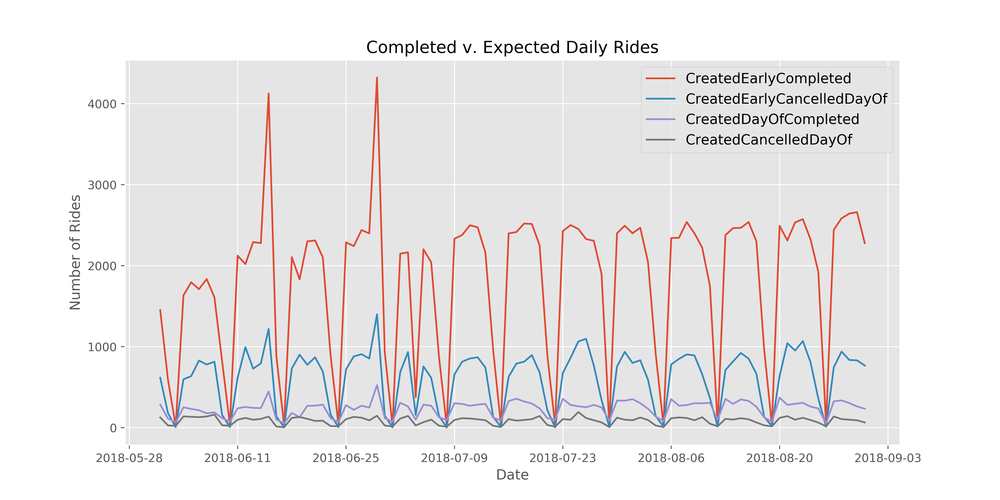

Put more simply, here are expectations vs. actual rides:

| Expected/Actual | Count to Date | Daily Avg |
|-----------------|:-------------:|:---------:|
| Expected |    223,696 | 2431.47|
| Actual |   189,374  | 2058.41 |

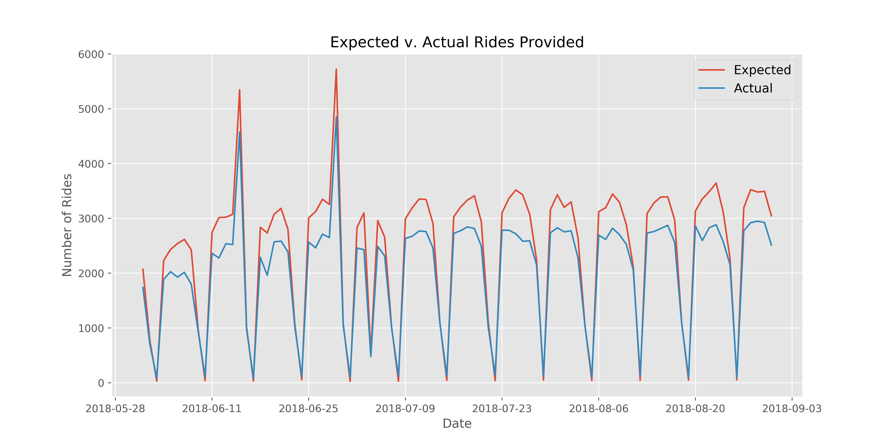

Note the wide gaps between expected and actual numbers on the weekdays, but that on the weekends, there are actually more rides than expected.

### Exploring Completion and Cancellation
As late cancellation seems to be driving the gap between actual and expected rides, further investigation of the when, where and who of completion v. cancellation was required.

#### Ride Completions v. Cancellations by Time
While roughly 30% of daily rides were cancellations, almost 30,000 of these cancellations were done before the day of pickup, meaning they likley did not impact business operations. I've discarded those records and mapped the rest below (CancelledHour and CancelledDayOf are mutually exclusive):
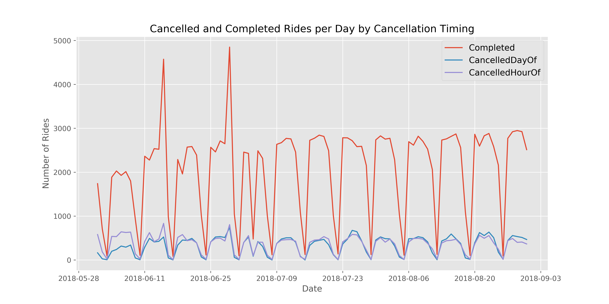

Both cancellations and completions rise and fall with weekday and weekends, although cancellations represent a lower percentage of total rides on weekends:
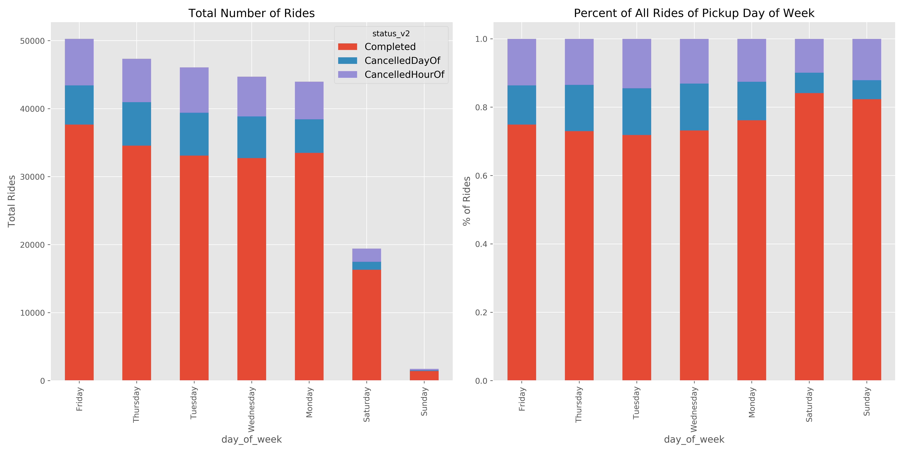

Overall late cancellation rates were as follows by day:
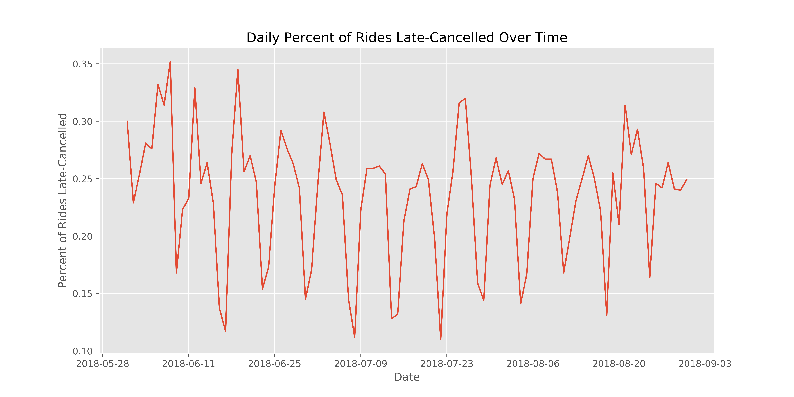

Pickup requests varied by hour as one might expect, with high request rates in the morning and mid-afternoon, and lower request rates at night and in the early morning. Pickups were also more likely to be on the hour, half hour and quarter hour than not.
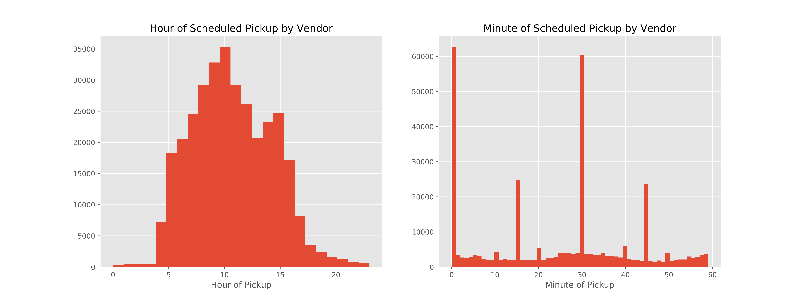

Both cancellation rates fell in early morning and at night:
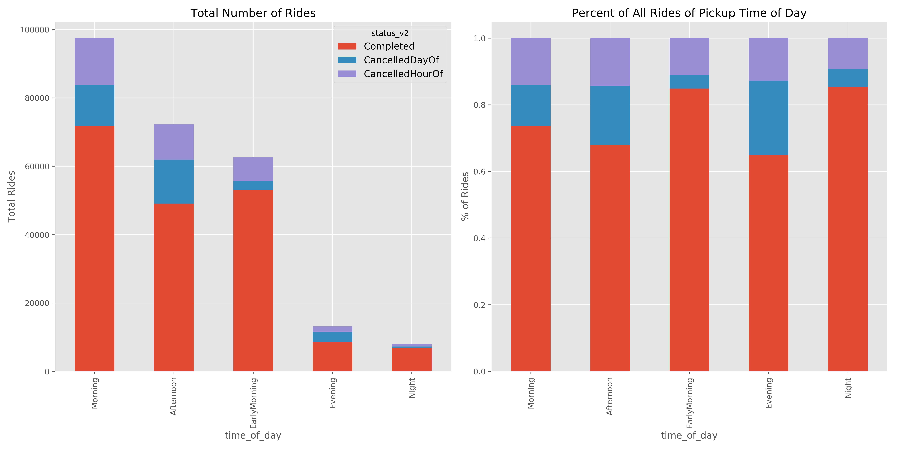

__Conclusions__: While early mornings, nights, and weekends require lower capacity overall, they also have lower cancellation rates, meaning that the expected numbers of passengers are more likely to be close to the real total.

#### Mapping Ride Completions and Cancellations to Geographical Location

In mapping where ride demand and cancellations occurred, I've used the folium package in python.

Completed pickup requests in Portland seem to cluster around the downtown area, with multiple small clusters in outlying towns:

__Completed Rides__

Cancelled rides appear to cluster in those same areas:

__Cancelled Rides__
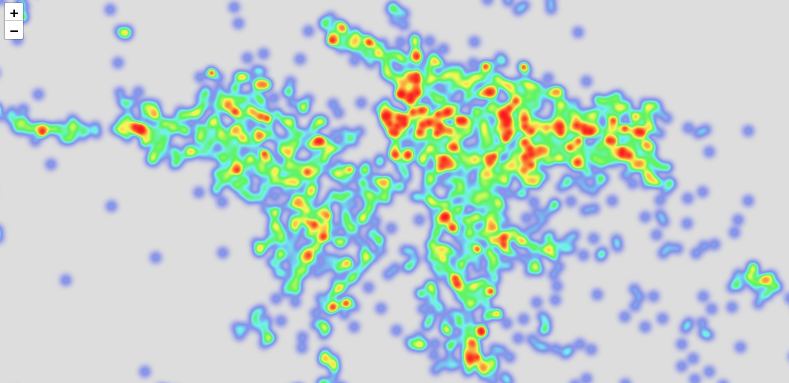

There is little difference in cancellation rate across zip codes with higher numbers of pickups.

__Late Cancellation by Zip__
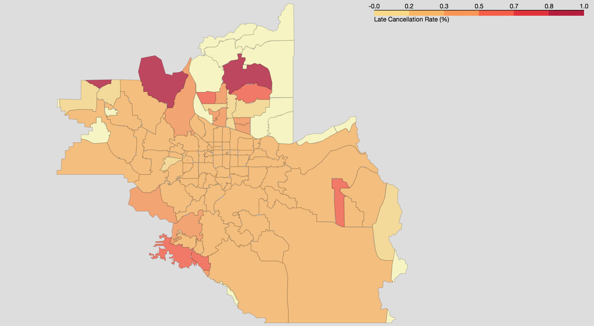

Below is a time-series heatmap of completion over time. Note that the clusters stay fairly constant in location over days of the week (with weekend days being lighter).

__Conclusions__: While these maps are useful for understanding where rides are originating and will later be useful for clustering and understanding where drivers should be placed, they do not currently provide much insight on where cancellations might occur.

___Note:___ In order to protect anonymity of the provider and to ensure we are not revealing patient medical information, I have removed the background from the map visuals in this section. I have also not provided the html maps themselves, but pngs and and gif of those maps, so that the source latitudes and longitudes cannot be viewed. In the interest of transparency, however, code for the creation of these heatmaps can be found in __[heatmap.py](src/heatmap.py)__.

#### Who is Cancelling late
Requested vehicle type of the user appears to matter little:
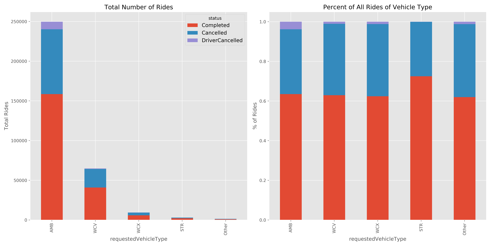

The company requested may matter, as a couple of companies had high levels of driver cancellations - which almost always happens the hour of:
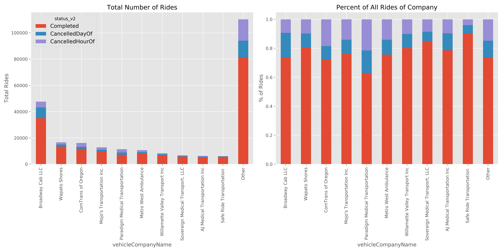

There are a number of power-users of TransportCo (as id'd by medical ID).
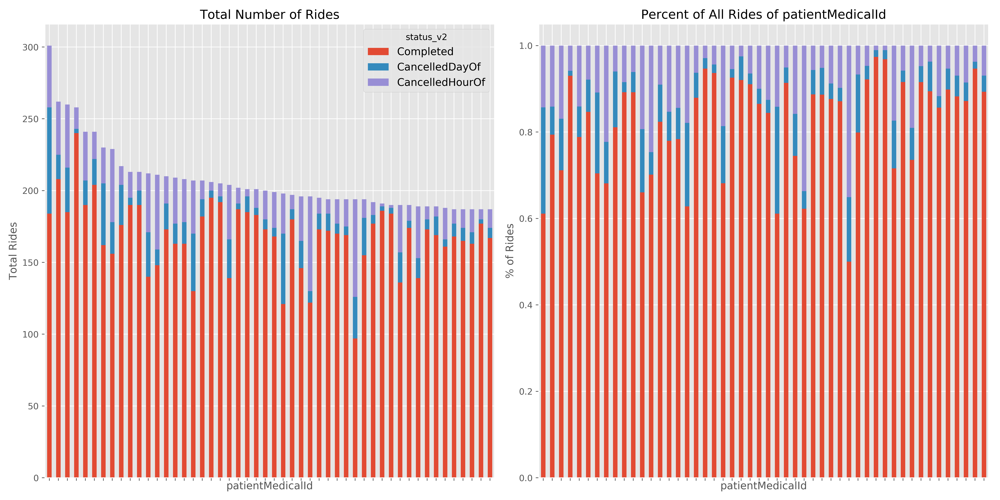

Some of these users have extremely high late cancellation rates, making them responsible for high amounts of churn:
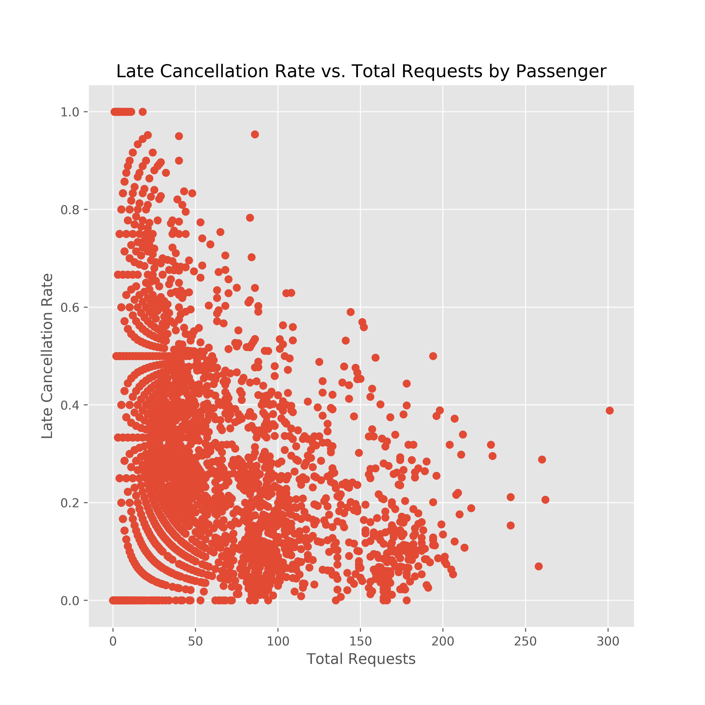

__Conclusions__: Identify users and companies who have high cancellation rates and reach out to them. Work with them to improve their use rates through nudges, app training, etc.

## Part 2: Modeling Late Cancellation
Given the conclusions above, an ideal product for TransportCo at this time is a classifier of user late cancellation likelihood using the features of the ride and the user to predict probability of day-of cancellation. As a final element of my project, I built such a classifier. I used data from 6/15 through 8/31 (as I was informed that the first two weeks of program startup were a bit operationally rocky, and thus different than the later weeks of implementation). The outcome I was aiming to predict was __late cancellation__, which I defined as _cancellation the day of the scheduled ride_.

### Feature Engineering
There were 15 non-textual features of the model I engineered:
- __Distance features__: Distance from center of the city, estimated distance of ride
- __Creation_time__: Dummy variables for whether request was created day of or hour of ride.
- __Time of Day__: Dummy variables for time of day categories (early morning, morning, afternoon, evening, night)
- __User features__: Counts of number of rides the user has taken to this point, late cancellation rate of user to this point
- __Ride Request Features__: Vehicle type, estimated cost

Along with these 15 features, I also developed a 'text_pred' feature that used Multinomial Naive Bayes Classification to predict cancellation or non-cancellation of a ride using solely the rideNotes column. These notes were left by patients or their schedulers prior to the ride and represented a patient's needs for the ride. Because they ride notes focused on instructions to the driver, it is likely that they are independent from other features, with the possible exception of vehicle type. Therefore, I believe it was acceptable to use this prediction as a feature.

The Multinomial Naive Bayes classification using rideNotes had the following predictive success on its own:

- Accuracy: 0.752
- Precision: 0.505
- Recall: 0.034
- ROC AUC: 0.511

This low level of recall is likely because it was conducted on pre-smoted data and thus tended to classify the majority of cases as non-cancels.

#### An Aside on NMF

Because I was interested, I also ran NMF on the 'rideNotes' column, using 20 latent topics (I a range of from 1-25 latent topics and found little to no elbow in the plot).

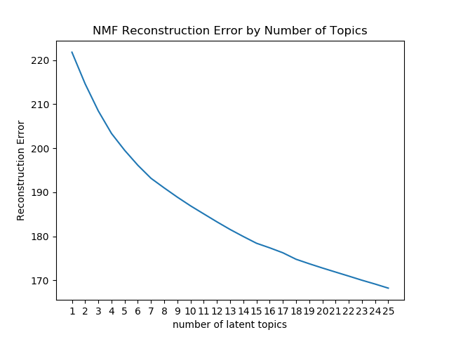

The following are the latent components, as named by me, with their top 5 associated words.

| topic |Assigned topic Label|Top 5 Terms|
|-------|-------|----------|
| 1     | wait time 1 | 'min' 'wait' 'return' 'leave' 'rtn'|
| 2     | passenger assistance 1 | 'door' 'mobility' 'devices' 'knock' 'attendant'|
| 3     | driver instructions 1 | 'arrival' 'call' 'upon' 'please' 'cc'|
| 4     | wait time 2 | 'minute' 'return' 'wait' 'waitreturn' 'pharmacy'|
| 5     | passenger assistance 2 | 'curb' 'mobility' 'one' 'devices' 'mbr'|
| 6     | pickup/drop-off 1 | 'suite' 'appointment' 'building' 'drop' 'appt'|
| 7     | urgency | 'day' 'ride' 'asap' 'urgent' 'reqst'|
| 8     | pickup/drop-off 2 | 'apt' 'cc' 'pick' 'b' 'doordoor'|
| 9     | vehicle needs 1| 'plus' 'one' 'mom' 'carseat' 'seat' |
| 10    | pickup/drop-off 3 | 'ste' 'bldg' 'doordoor' 'drop' 'b'|
| 11    | passenger assistance 3 | 'hand' 'client' 'amb' 'stretcher' 'needs'|
| 12    | passenger assistance 4 | 'walker' 'folding' 'uses' 'foldable' 'mbr'|
| 13    | passenger assistance 5 | 'cane' 'uses' 'sometimes' 'member' 'mbr'|
| 14    | wait time 3 | 'wr' 'min' 'waitreturn' 'pharmacy' 'canedd'|
| 15    | wait time 4 |'please' 'minutes' 'client' 'member' 'wait' |
| 16    | vehicle needs 2 |'wheelchair' 'standard' 'lift' 'electric' 'manual' |
| 17    | driver instructions 2 | 'dd' 'upon' 'knock' 'pu' 'bldg'|
| 18    | pickup/drop-off 4 | 'er' 'floor' 'lobby' 'ride' 'th'|
| 19    | wait time 5 | 'mins' 'return' 'wait' 'pharmacy' 'id'|
| 20    | pickup/drop-off 5 | 'wc' 'transfer' 'doordoor' 'standard' 'manual'|

### Pre-Processing/SMOTE
As only roughly 25% of clients cancel late, there was a class imbalance, which I addressed using SMOTE, bringing my train data set up to 61,000 each of label 0 (no cancellation) and label 1 (late cancellation). The following code shows the concatenation of the nmf matrix with the data set and the SMOTE oversampling technique only on train data:

### Fitting multiple models
I tested a range of models, including the following, with the following train results:

| Model | Description | Accuracy | Precision | Recall | ROC Area Under Curve |
|:------|:------------|:--------:|:---------:|:------:|:--------------------:|
|Logistic Regression Base Model|Pre-set hyper-parameters|0.636|0.628|0.665|0.636|
|Logistic Regression Model 2|L1 Penalty Added|0.636|0.628|0.665|0.636|
|Random Forest Classifier Base Model|Pre-set hyper-parameters|0.766|0.804|0.703|0.766|
|Random Forest Classifer Model 2|1000 trees, Min leaf samples=2|0.794|0.807|0.773|0.805|
|Gradient Boosting Classifier Base Model|Pre-set hyper-parameters|0.713|0.704|0.735|0.713|
|Gradient Boosting Classifier Model 2|100 trees, Min leaf samples=2|0.681|0.662|0.737|0.681|
|Adaptive Boosting Classifier Base Model|Pre-set hyper-parameters|0.680|0.677|0.690|0.680|
|Adaptive Boosting Classifier Model 2|100 trees, Learning rate of .01|0.627|0.636|0.549|0.627|

### Model Performance

Given the cross-validated results, I selected the random forest + model and implemented it on the test data. Precision and Recall were notably lower than in cross-validation:

__Final Model - RF with 1000 trees:__
- Accuracy: 0.741
- Precision: 0.476
- Recall: 0.494
- Area Under Curve: 0.661

This is possibly due to SMOTE-ing, which creates new data and therefore may have created a data-set somewhat different than the test set.

The final ROC curve was as follows:
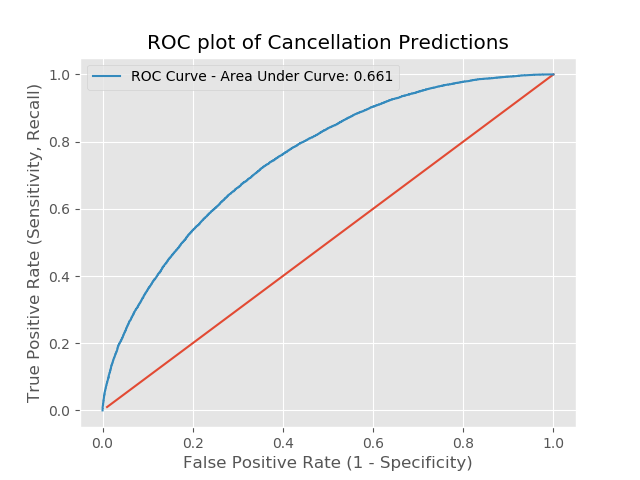

I calculated a Naive baseline with which I could compare the model's performance. For this baseline, I marked any ride where the scheduler had a cancellation rate of 50% or above as being a likely cancellation. This baseline produced the following results:

- Accuracy: 0.745
- Precision: 0.373
- Recall: 0.047

Therefore, while a Recall of 49.4% may not seem high, it is ten times beter than the the naive baseline (meaning we catch 10x as many late cancellers at at a higher precision).

### Feature Importance
The following are the logistic regression coefficients for the features of the model. Interestingly, the count of rides completed had a large negative coefficient, meaning that the more rides a user has completed, the less likely he/she is to cancel:
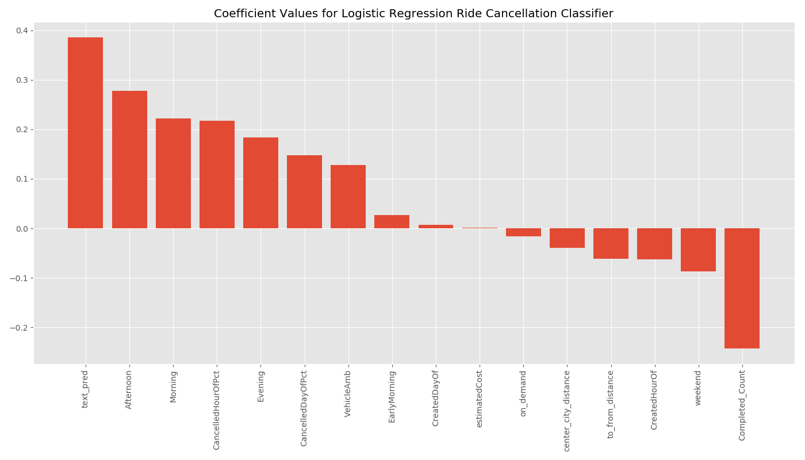

Interestingly, the text prediction of how likely a user was to cancel had the highest positive coefficient by far. The highest negative coefficient was in the number of rides a user had previously completed.

Feature importance in the Random forest model was as follows. Note that while you cannot tell the direction of the impact of each feature in a random forest, the magnitude of feature importance for our final model roughly lines up with magnitude from the original logistic regression:
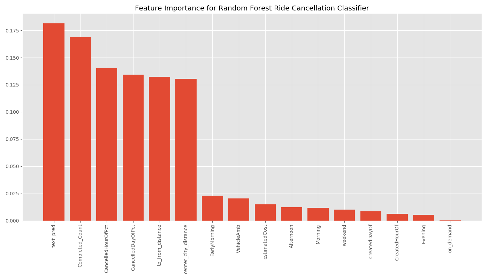

The feature importances here line up nicely with the logistic regression coefficients.

## Part 3: Modeling Hourly Rides Completed
The second task I took on was to model actual rides provided by TransportCo in any one hour of the day. This would help the company to allocate vehicles and drivers over the course of they day.

I considered a range of lag times between prediction and occurrence, finally settling on the fact that it would be ideal to know your needed capacity for rides 24 hours beforehand. Therefore, the predictions in this section represent the prediction of ride completion for an hour that is 24 hours from the current time.

### Feature Engineering
Using timestamps, I calculated the number of rides that had been scheduled at that hour. Using these scheduled rides, I calculated the percentage of "scheduled" rides that had been completed for each hour previous to the time at which I was predicting (using only the knowledge I would have 24 hours ahead of my hour of interest). This "Expected Percentage" became the key feature of my model.

I also included whether the ride was a weekday or weekend, and what time of day the ride was occurring at. Finally, I also included the number of completed rides from the day before as a feature.

### Model Results
I again tested multiple models, this time regressors. These included linear regression, Lasso regression (linear regression with a penalty for absolute value of the coefficients), Ridge regression (linear regression with a penalty for squared value of the coefficients), a Random Forest Regressor, and Gradient Boosting and Adaptive boosting Regressors.

The best results were achieved using Lasso Regression with an alpha (penalty) of 1. This model had an __RMSE of 9.13 rides__ on holdout data, meaning roughly that on an average hour, I was off by about 12 rides. This is not a bad result when you note that during the day there are around 300 rides per hour.

However, I also calculated a naive baseline for these predictions, in which I used only my 'Expected Rides' variable (which, remember, is historical cancellation rate times # of scheduled rides). This variable, it turns out, was almost as good as my own modeled predictions, with an __RMSE of just 9.74 rides__ on holdout data.

The following image shows the predictions of both predictors agains the actual rides on the holdout dataset:
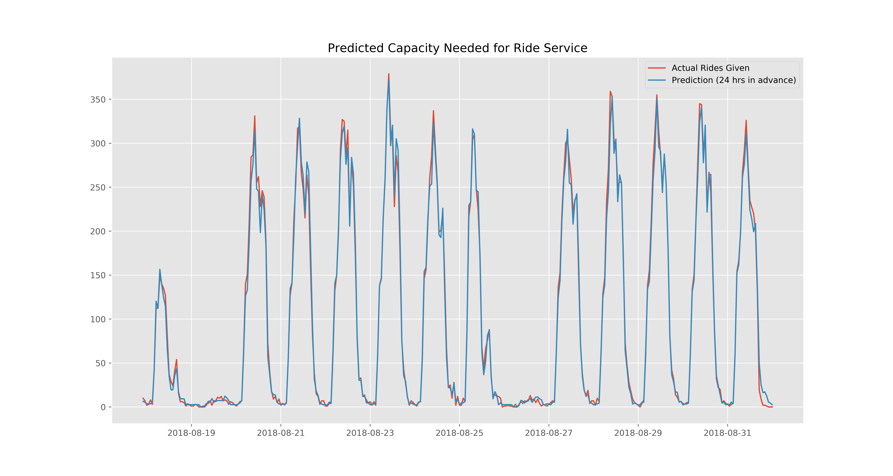

Given that the single variable explains the majority of the variance and is clearly not overfitting, I suggest that this baseline is used as the key predictor of upcoming rides.

## Part 4: Prototyping a Dashboard App
In order to facilitate the use of these two predictions, I developed a prototype Dashboard ([publicly linked here](http://54.215.201.137/)) using Flask and AWS.

The dashboard has two pages. The first page (the 'Cancellation Dashboard') is for an employee of TransportCo to review the scheduled rides in the coming day and identify those that are expected to cancel late:

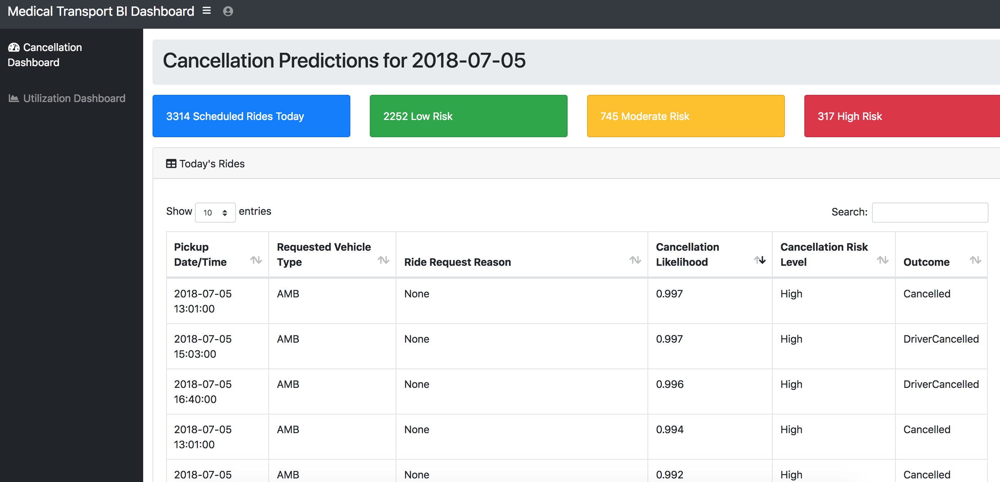

The second page (the 'Utilization Dashboard') shows the number of rides predicted to be actually given for each hour of the next 24 hours. For comparison, it also shows the rides provided in the previous 24 hours and the prediction of those rides.

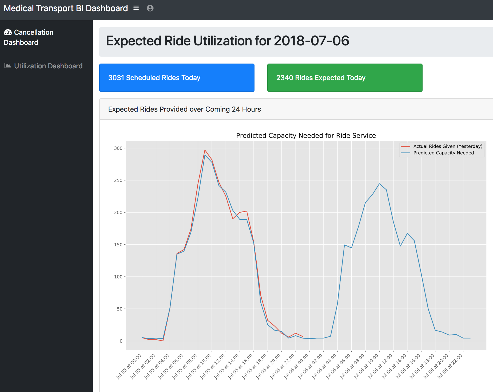

While built on historical data, the prototype dashboard has been made to mimic the feed of realtime data by pulling in a day's worth of new data from a Postgresql database (also hosted on AWS) every 60 seconds. The design of the dashboard's back-end is as follows:

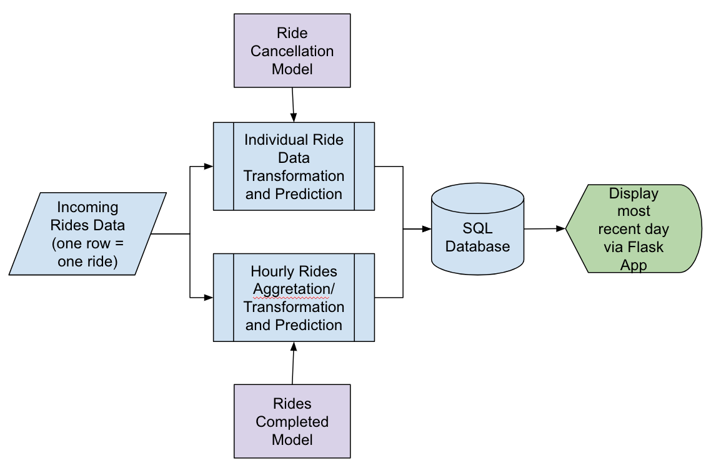

## Conclusions and Next Steps
__Conclusions__
- ___Predicting ride cancellation will enable TransportCo and its partners to nudge likely ride cancellers towards completion of their rides, saving TransportCo, medical providers, and their patients money in the longterm.___
  - We are able to model Cancellation well enough to predict roughly half of cancellations, although precision of our model is low. As the cost of falsely predicting a cancellation is fairly low, this is not a large worry.
  - We will likely be able to better model canclellation if we can access patient traits and information about the type of healthcare they are seeking.

- ___Predicting rides completed in a given hour will enable TransportCo and its partners to better allocate their vehicles and drivers, saving them money.___
  - Maybe unsurprisingly, the single indicator of 'Expected Rides' was all we needed to model completion accurately. It performed better than more complex models
  - This model could and should be used at the zip code or neighborhood level, as it will further improve allocation of vehicles and drivers.

__Next Steps__

Proposed next steps are as follows:
- Further refine prediction algorithm for cancellations and deploy with TransportCo on different types of cancellation.
- Explore other variables to identify whether we can model completion better than the baseline indicator.
- Map expected completions at the zip code level.
- Use k-means clustering to suggest placement of vehicles in locations throughout the metro area that will best minimize pickup time.
- Implement the proto-typed dashboard with TransportCo and its clients.

## Code
Code used for this project is mostly located in the src folder of this repo. It includes:
- __[df_create.py](src/df_create.py)__: Creation and editing of the data frame given the data extract provided by TransportCo
- __[eda.py](src/eda.py)__: Exploratory data analysis of who, when and where ride requests and cancellations were occurring. Produced most of the graphs in this README.
- __[heatmap.py](src/heatmap.py)__: Created the heatmaps in the mapping section using the folium package.
- __[modeldf_create.py](src/modeldf_create.py)__: Further edited the data frame used in exploratory analysis so that it was prepped for the modeling of late cancellations and ride completion.
- __[cancel_mod_explore.py](src/cancel_mod_explore.py)__: Testing of different modeling of cancellation.
- __[cancel_mod_final.py](src/cancel_mod_final.py)__: Creation and application of a class from best model for that predicts cancellation. This code is applied to new incoming data in the app.
- __[complete_mod_explore.py](src/complete_mod_explore.py)__: Testing of different modeling of completion.
- __[complete_mod_final.py](src/complete_mod_final.py)__: Creation and application of a class from best model for predicting ride completion. This code is applied to new incoming data in the app.
- __[update_sql_db.py](src/update_sql_db.py)__: Used to create and update the SQL database for creation of the app.
- __[app.py](rideapp/app.py)__: Code creating and running flask app. Pulls from html templates stored in static folder.
